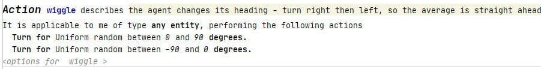

# Wolf Sheep in ODD2Netlogo
This document will serve as a tutorial for how to write the wolf sheep model in the ODD2Netlogo project. 

The Wolf Sheep model explores the stability of a predator-prey ecosystem. The system is unstable if one or more of the 
species involved in the simulation becomes extinct. If the species involved are able to endure over time, despite 
fluctuations in population sizes, the system can be deemed stable.
More details of the Wolf Sheep model can be found [here](https://ccl.northwestern.edu/netlogo/models/WolfSheepPredation).

## Making the model
### Setup
Before making the model, verify that the version of your MPS is the same as the one used in the project.
Next, generate the project by right clicking on `formalodd` in the Logical View of MPS (left sidebar) 
and clicking `Rebuld language 'formalodd'`

To create a new model, in the Logical View, open formalodd.sandbox, right click `odd` and select `New -> ODD`

### Writing the model
#### Defining model entities
1. The first step  is to identify all entities involved in the model. In our case we have the two entites, wolf and sheep. \
   These needs to be defined within the section `Overview: Entites, state variables, and scales`. \
   Click on the text `Press enter to create EntitesStateScales` and press Enter.
1. Locate the Entities subsection, click on the text `<press enter to create entity>` and press enter to add an entity. \
    We need two entities for this model: `wolf` and `sheep`.\
    To add multiple entities, press the bottom-most empty line in the Entities section, and either use the 
    context assistant menu buttons, or press enter. (Should be more intuitive)

1. In addition to entities, we can also add environment entities. In this case, we want the environment entity `grass`.\
    Locate the Environment entities section and add a new environment entity and name it `grass`. 
    
    In this case, we want the color of the `grass` to be scaled, to indicate the amount of grass during the simulation.\
    Select ScaledColor, the color green and leave `<no attribute>` empty for now.

#### Attributes
The simulation also needs attributes (or variables), and these are added depending on how they are going to be used \
    in actions. 
    
1. Start by adding the environment attribute grass-amount. \
    Locate the section Environment Attributes, and add a new attribute `grass-amount` and set it to type **Number** \
    Go back to the Environment Entity Grass, and set the ScaledColor attribute to the newly created `grass-amount`

1. Model parameters are defined in the section Model parameters, in this case we need numerous attributes defined here. \
These will serve as something similar to global variables. Insert all of the following attributes of type **Number**
    1. `energy-gain-from-sheep`
    1. `energy-gain-from-grass`
    1. `grass-regrowth-rate`
    1. `sheep-reproduce`
    1. `wolf-reproduce`
    1. `movement-cost`
    
1. All entities need a attribute Energy, and this can be added in the subsection 'Common Attributes of all Entities'\
Add a entity common attribute `energy`.
    
    
#### Initialization
We need to specify how the entities and attributes are initialized in the model. This is done in the section 'Details: Manual Experiments AKA Initialization'

1. Set all model parameters to be initialized by method of Slider.
1. Configure initial amount of both entities to be of type Slider. \
Set the initialization distribution to **random**.
1. Set the Share Attribute `energy` to be of type NumericConstant, and set it to `100`
1. Our Environment attribute `grass-amount` should be initialized randomly, press ctrl+space and select RandomUniform,
in each of the `expression` blocks: go to the beginning of the text and hit ctrl+space and select **NumberConstant**, 
and specify the  lower and upper limits to `0` and `100` respectively.
1. Configure the grass environment initial location to `everywhere`

#### Process overview and scheduling
The section process overview and scheduling contains the logic aspect of the model. We will define several  \
Actions and Interactions which will be callable and perform different functions during the simulation.

To create an Action or Interaction, go to the section Overview: Process overview and scheduling, and click on the `<click for options>`\
and press the needed  
##### Example Action `wiggle`
**Description**: the agent changes its heading - turn right then left, so the average is straight ahead

1. Create an Action and name it `wiggle`.
1. Make `wiggle` applicable to **any entity** by pressing ctrl+space on the empty field and selecting `AnyEntity`. 
1. Press enter and when on a new empty line press ctrl+space, and select `Turn`. Press the `expression` and hit \
ctrl+space on the beginning of the word. Select `RandomUniform`. In each of the new `expression` fields, press ctrl+space \
and select  **NumberConstant**, and place `0` and `90`.
1. Repeat the same process as above, but change the turn degrees to `-90` and `0`

See image for the resulting Action.

##### Action `move`
**Description**: the agent moves which costs it energy
1. Create an Action and name it `move`
1. Make it applicable to `AnyEntity`
1. On a new line, press ctrl+space and select Move, then set the distance to 1 pixel
1. Another new line, press ctrl+space and select `Decrement energy`, and in the field `<no rhs>`, press ctrl+space and
select the attribute `movement-cost`

##### Interaction `eat-grass`
**Description**: sheep eat grass
1. Create an Interaction, and name it `eat-grass`
1. There are two parties in an interaction: Partner 1 and Partner 2. In this case Partner 1 is a concrete entity type, \
and partner 2 is an environment. To To insert concrete types select the option `ConcreteEntityReference` and then
select the specific entity to represent partner 1 and select sheep. For partner 2 select `AnyEnvironment`
1. We need to make sure that there is enough grass in the enviornment entity, and check this with a simple `if` clause.
To add an if, mark the `press enter to add actions`, press enter, and hit ctrl+space on the empty box. 
Select `ConditionalAction`. We want to compare the grass amount to see if it is enough for 1 bite (energy gained from grass). \
Select `Comparison` and on the first expression select `grass-amount` and on the last expression select `energy-gain-from-grass`, 
and make sure that the operator chosen is `>=`.
1. Inside this if clause we need to define what happens if the conditions are met. We want the grass to decrease and the sheeps energy to increase.\
On a new line, select  `increase energy` and set amount to the attribute `energy-gain-from-grass` \
On another new line select  `decrement grass-amount` and set the amount to the attribute `energy-gain-from-grass` 

##### Interaction `eat-sheep`
**Description**: wolf eat sheep
1. Create an Interaction, and name it `eat-sheep`
1. There are two parties involved, both of which is a `ConcreteEntityReference`. Partner 1 is `wolf`, partner 2 is `sheep`
1. First empty line, select `KillEntity` and make sure that the sheep (partner 2) is the target.
1. Increase the wolf's energy by adding new line, select `increase energy` and this is to be incremented by 
the attribute `energy-gain-from-sheep`

##### Action `check-if-dead`
**Description**: when energy dips below zero, the entity dies.
1. Create an Action, and name it `check-if-dead`
1. Make it applicable to **AnyEntity**.
1. Make a `ConditionalAction`, and compare the `energy` attribute to make sure that it is operator < compared 
against the NumericConstant `0`.
1. If the condition is met, select `KillEntity` and partner 1 (self in this case)

##### Action `reproduce`
**Description**: produce new sheep, divide energy between parent and child
1.  Create an Action, and name it `reproduce`
1. Make it applicable to **AnyEntity**
1. Made a `ConditionalAction` and a `Comparrison`, where the first expression is a `RandomUniform` of range 0 and 100\
Compare this value to the attribute `sheep-reproduce` with the operator `<` (Random number is less than the reproduce rate)
1. If this condition is fulfulled, set the energy to `energy / 2`

## Running the model

